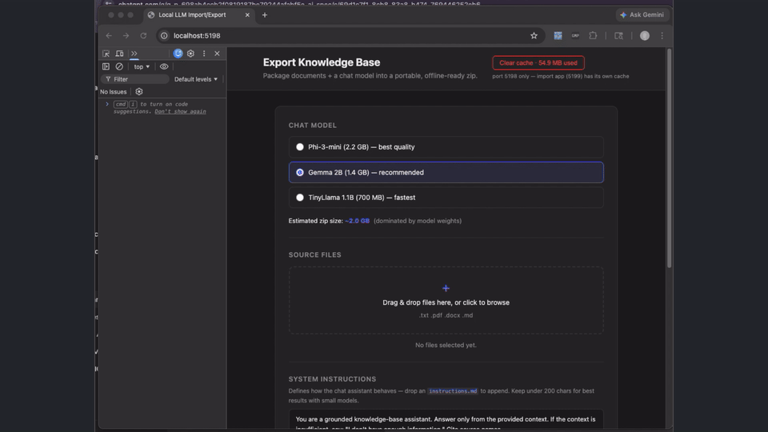

# Local LLM Import / Export

Portable offline knowledge bases for air-gapped and no-internet environments.



## What It Does

This project turns a set of documents into a self-contained knowledge bundle that can be opened in a browser and queried fully offline.

It is built as two separate browser apps:

- `apps/export`: package documents, prompt instructions, search index, and model assets into a portable bundle
- `apps/import`: open that bundle later and chat with it locally, with no server and no internet

The intended flow is:

1. Open the export app while online.
2. Add your documents and generate a portable knowledge bundle.
3. Move that bundle to the target machine.
4. Open the import app and chat with the bundled knowledge completely offline.

## Why This Exists

This is aimed at environments where cloud APIs are not an option:

- factory floors
- secure customer networks
- hospital and government systems
- ships and field deployments
- offline developer environments

Instead of deploying a backend, vector database, or local Python stack, the workflow stays inside the browser.

## How It Works

The exported bundle contains the ingredients needed for offline retrieval and answering:

- source documents
- chunked knowledge data
- offline search index
- prompt instructions
- model assets required by the browser runtime

At import time, the browser restores that bundle locally and runs retrieval plus answering on-device.

## Repo Layout

```text
apps/
  export/   Build the portable knowledge bundle
  import/   Load a bundle and chat with it offline
```

## Local Development

From the repo root:

```bash
./scripts/dev.sh
```

Or run each app directly:

```bash
cd apps/export && npm run dev
cd apps/import && npm run dev
```

Default dev URLs:

- Export app: `http://localhost:5198`
- Import app: `http://localhost:5199`

## Status

Open source MIT project focused on practical offline LLM workflows in the browser.
